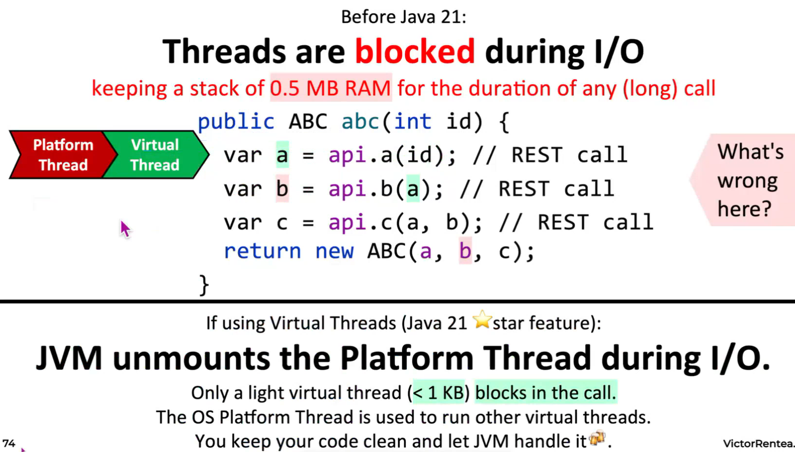
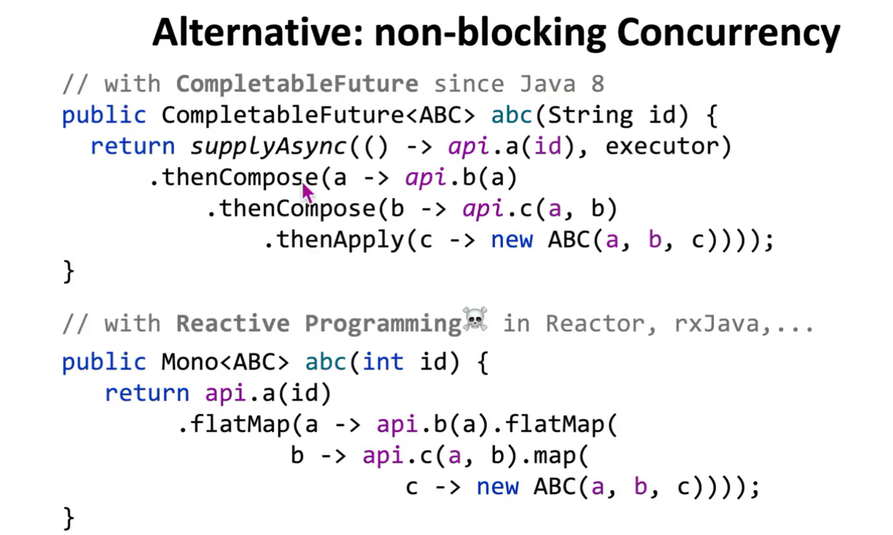
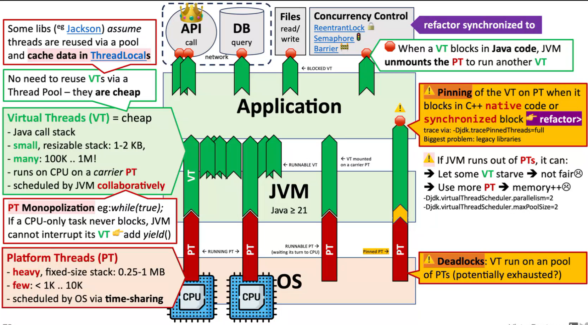
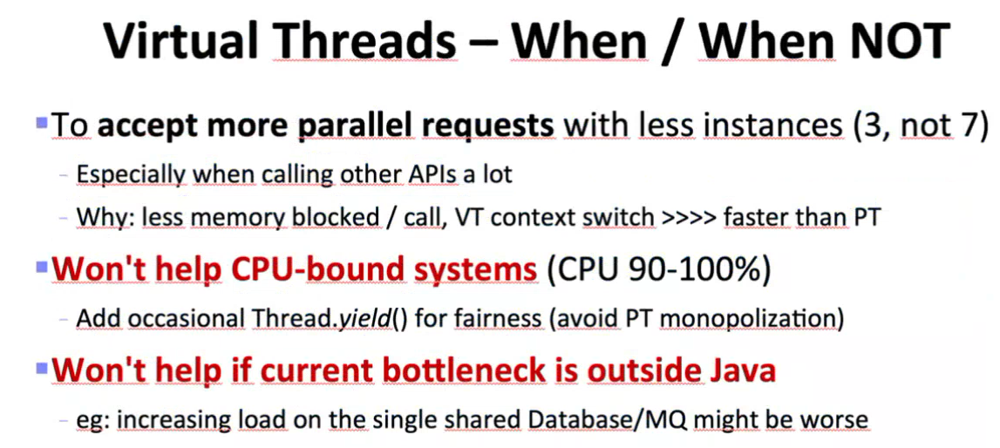
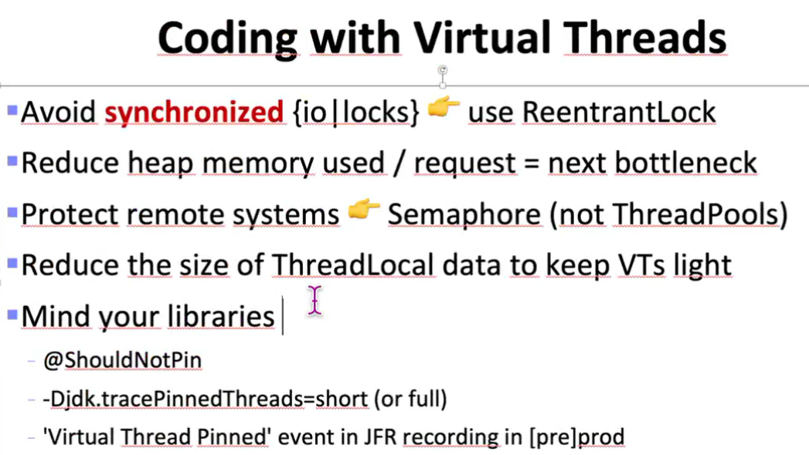
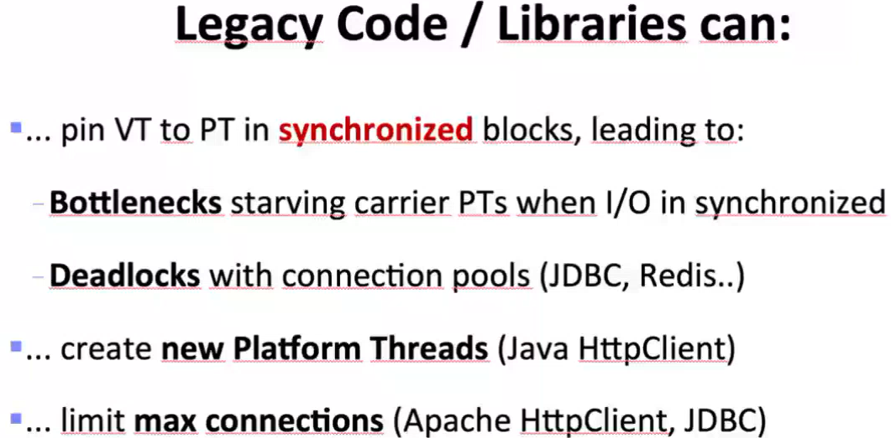
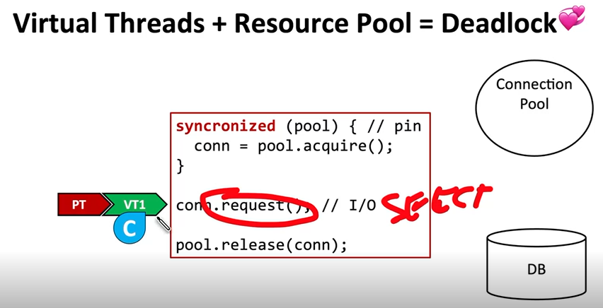
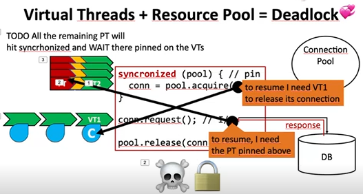
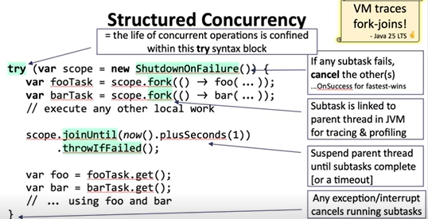

Virtual threads - Project Loom & friends [21]
More details about virtual threads:
- https://www.youtube.com/watch?v=tykrCxwmMG4&ab_channel=vJUG
    - deadlock some pitfalls

That calls API after API, after API after API.
Notice that, in this case, you can't really optimize.
You can't really parallelize anything because the input of the first method is required in the second
and then the outputs need to be changed to one another.
So there is no way I can parallelize anything the method the calls have to happen in a sequence
first call then wait and then go to for the second call. Here is not about parallelization.
The goal here is to call the network and file a request to another server while blocking a thread.
In the discussion, we had about half of MB RAM. Get blocked for that duration.
So that was historically a problem in Java until Java 21 because you blocked that memory for that duration.
Now what Java 21 brings their flagship feature is that when you enter, if you choose, that's an option.
If you choose to work on it, if you choose to enable virtual threads in handling your request, and if a virtual thread enters this method, that virtual thread is technically a very lightweight thread.
Java construct like it was it had many names: fibers virtual thread, Lightweight thread (1kb), and one more green thread.
They mean that it's a JVM-specific construct that sits on top of the operating system platform.
So this is managed by Java, and this is basically your code if you enable it.
If you want to use virtual threads, enable them in application.properties or in your code.
You'll have to tell Tomkat to start a new virtual thread (1kb) for every incoming HTTP request instead of the Platform Thread(0.5 MB).
You're gonna enter this method now with a riding a virtual thread.
Now, what happens under the hood of this virtual thread?
I will walk your method, but to execute stuff on the processor, it has to ride on a platform trip.
So anytime you hear a virtual thread executing code, it can only execute code if it stays on top of a platform,
that of one of those threads.
The red part is 0.5 MB or this is really heavy, right?
The green part is extremely lightweight and is less than 1 KB.
So much lightweight, much lighter than the platform.
So you enter this method with a virtual thread and the moment your call gets into your code calls network.
Then JVM is smart enough to leave (since 21) your virtual thread waiting there and unmount the platform thread from underneath
you to use it for something else.
So JVM unmounts the platform thread during any IO, only blocking what you do.
And so there in that core will be just a virtual thread, a very light virtual thread remaining
there waiting for the operating system platform that is used to run other virtual threads.
So the platform thread relies on, and it's assigned to some other virtual thread, and you just leave behind 1 KB.
The goal? Is to have your code clean and let the JVM handle that.

That misery, the code in front of you just now if you write it with compatible future.
It is absolutely gross. All this with have to give it if you want.
It's very, very hard. You have to compose and compose again inside extremely contrived code.
So Java language saw us struggling with callback based non-blocking concurrency,
and they added to Java 21 almost 7 years. It was a very long effort in Java to make this happen.
But now your code looks like this and it's as efficient.
As you don't have to use any web client.
And if you are using a web client or the other, you can just replace over here with block.
if I mean OK if this code is executed, but what? What this code? It can be confusing if this method is runs on a virtual thread.
Because you don't lose memory.
That's it.
The thread stack is extremely light for a virtual thread. That's the game that they introduced in 21.

Here is a horror slide which summarizes all that virtual thread do along with some of the pitfalls they can run into.
So first of all, we have the operating system, the Linux underneath us right now.
The Linux sits on top of two CPUs in there we have two cores.
Now in order to be able to execute on one of these cores, you have to run on one of the threads,
the Platform Thread (PT), they are called which are provided by the operating system.
Synchronized keyword is not friendly with virtual, the solution is to refactor this to reentrant lock.
I did such an experiment in the video there you just replay synchronized with reentrant lock require and release. That's it.
But I wish it were that simple.
The real problem with synchronize is that the legacy libraries that are using. synchronized inside them.
So if you use some library which is before Java 21, of course we do, they will use heavy heavily the synchronized keyword.
So if you from application going to a dark old library and that library inside of it has a synchronized keyword,
If you enter that library with a visual thread riding a platform thread, and if you block inside the library.
The virtual thread gets stuck because the application use library with the platform that in OS.
This is the real problem with virtual threads that the library that we work that we use today are not ready for platform thread
for virtual thread in the sense that they do synchronize.
They hijack the whole machinery. That's the problem. Not necessarily our code the biggest problem.
Problem is the legacy library which do not support it, they took steps to replace.
They took for example Jackson that supports the serializing to Jason, supports virtual thread
So in the release notes for the driver for progress gdpc, for example, there is a refactor to replace the usages of synchronized with reentrant lock.
that's what they did everywhere in the driver to support visual threads and that should that happened recently.
The libraries might hijack the whole story.
That's what I want to point out.
So you can't just turn on virtual thread and consider the problem solved.
No, we have to carefully look for places where your virtual thread get "pinned".
You can see them in your production. You can put this logging and enable this flag it will print in the console whenever a virtual thread gets stuck.
With a platform thread underneath it. These events are fired by the Java virtual machine.
You see where this happens and you then if that happened in the library, could be really, really tricky.
There are some more and also deadlock in the video.
I also demonstrate how you can have a deadlock. link to youtube above.

You're gonna have to have another way to restrict the maximum concurrency in practice.
It smells like a semaphore over there, like if you know the concept semaphore, you have to have other mechanics to restrict the maximum concurrency.
Previously it was simple.
You created a thread pool with 200 threads and that was the maximum concurrency you could ever get.
It was very simple to redid that together.
we configured thread pool and we said 50 maximum thread.
Now, besides those fifty, you can have 500 waiting in the queue and that's it.
It's all 550 Max, with virtual threads 1,000,000.
You have to have some mechanic to restrict the concurrency.
The mechanics that you could use, for example in a spring boot application is tomcat.max-connections proprerty (It will take maximum 1000 connections from the socket).
If you want to go more than that, you can need to adjust this, but there is a cap for the maximum connections open to the clients.
The other boundaries are going to explore and you have to measure.
You have to start experimenting.
You can't just enable them and hope it will work like a charm. There could be a library hurting you.
There could be some CPU task which does not release the CPU, like monopolizing things.
There are other dark stories about thread locals and caches, Deadlocks .
And there are several reports in the industry of adopting visual threads.
Very, very good articles if you want to. Dig more into this.

▪Understand Virtual Threads
-Intro - https://blog.rockthejvm.com/ultimate-guide-to-java-virtual-threads
-Virtual Threads design explained by Lead of Project Loom@Oracle - https://youtu.be/EO9oMiL1fFo
-Virtual Threads vs (Kotlin) coroutines by Venkat at jPrime'23 - https://youtu.be/uoTyIFvckXA
▪Industry War Stories
-medium.com/@phil_3582/java-virtual-threads-some-early-gotchas-to-look-out-for-f65df1bad0db
-blog.ydb.tech/how-we-switched-to-java-21-virtual-threads-and-got-deadlock-in-tpc-c-for-postgresql-cca2fe08d70b
-blog.ycrash.io/pitfalls-to-avoid-when-switching-to-virtual-threads/
-https://www.infoq.com/news/2024/08/netflix-performance-case-study/
▪Library support for Virtual Threads:
-HikariCP:https://github.com/brettwooldridge/HikariCP/pull/2055
-Jackson✅: https://github.com/FasterXML/jackson-core/issues/919
-Spring Boot✅: https://spring.io/blog/2022/10/11/embracing-virtual-threads
-Postgres JDBC✅: https://jdbc.postgresql.org/changelogs/2023-03-17-42.6.0-release/

* The goal is to accept more parallel requests with less instances of your application, especially when you call other APIs a lot that you have to wait for.
  why the benefit is the goal would be to have less memory blocked while you wait for the response.
  Plus, there is another hidden dark advantage that you get a faster context switch.
  ING from 1 virtual thread to another is much faster, so you actually get a performance boost in terms of juggling with those million threads.
  It's very fast to switch one to another. This is what they are designed for.
  Systems under heavy load that turn the other way and file requests against other systems.
* It won't help CPU bound systems.
  In which if we have some tasks which are very intense with CPU,
  you could add occasional Thread.yield() for fairness to avoid platform thread monopolization like we discussed just now.
* it won't help if current bottleneck is outside Java.
  in the sense that if you pass all that heavy load onto the next server they might just blow up.

when you code with virtual thread there are some pitfalls to avoid:
* Think avoid synchronized user entered block.
* The next goal you're gonna have is to reduce the amount of memory you keep in heap per request.
  stacks decreased from half a MB down to one kilobyte, but then there is heap.
  You need to do tricks to reduce what you keep in memory for the duration of those calls that you just do to others.
* Protect remote systems if you are not not to flood them with requests,
  maybe you can use a semaphore to restrict the maximum concurrency.
* You should avoid using thread local data because that is bound to thread and if you multiply anyone they suppose you you keep 2 kilobytes of data.
  Per thread local, if you multiply that with one million, that starts to matter.
* Mind the libraries. This is the biggest problem in practice.
  When you adopt virtual threads because they are going to do synchronized and there are some solution that I demonstrated in the video above,
  which for example you can write unit test. It would fail if it detects a thread pinning.
  you can actually write a test to prove that you did not PIN virtual threads on the platform thread @ShouldNotPin.
  To prove it, you can run to production with -Djdk.tracePinnedThread=short(or full) enabled to see where the pinning happened,
  and you can also see events 'Virtual Thread Pinned' in the Java-Flight-Recording (JFR) in pre/prod.

-------

You always have to have some sort of resource pool. The most common type of resource pool is a jdbc pool. 
A connection pool in this in the reports are jdbc connection pools.
So imagine you have a connection pool, a jdbc connection pool is a collection of connections opened to the database.
Imagine you having in the connection pool a single connection left.In order to grab it from the connection pool.
The drivers might synchronize if they are were not updated to use reentrant lock.
Many drivers they use synchronized in order to guarantee that one single thread at a time tries to acquire a connection from the pool to serialise the acquiring.
Technically to. If you have multiple threads to get one by one from the pool, 
you're gonna get the connection on your virtual thread, The connection is gonna be bound to your thread until you finish working with it, 
Until you do release, what happens next is that you continue you fire a database call like a select, if you want select using the connection 

Then because you exited the jvm and you went over network, the virtual thread is gonna be unmounted from the platform thread.
So your request is fired and when you start waiting. Jvm steals your platform thread releases it and puts it to work to one other task (virtual thread).
The other task (PT.VT2) wants to execute the exact same code, and hit the synchronized keyword because it we have pinning happening.
VT1 become stuck with the platform thread behind. Now we are already in the deadlock.
Why? For PT.VT2 to be able to enter sync block, the connection must be released from the VT1.
Now, when the response comes from the database. in order for the virtual thread to continue to run on the CPU, it needs a PT.
VT1 needs the platform thread above which is stuck on the VT2. So VT1, in order to make executing the work and eventually reach and release the connection, it has to grab PT.
The problem is that VT2 needs the connection from VT1. Which VT1 is unable to release until it gets the platform thread from VT2.
All the remaining platform thread will hit the same synchronized block and will be pinned on the virtual threads,
So this basically  exhausts all the platform threads and the virtual threads won't be able to continue to run, 
because they (VT1,...- that waiting to release after got response) can't find any platform thread available anymore.
Deadlocks are always hard to grasp, worst things that can happen in a production system. Your application paralyzes.
You cannot reach the database anymore.Your instance is dead.

This shouldn't happen often.It only happens if the jdbc driver that you're using a synchronized.
Behind the scenes, if it was upgraded, updated to work with Java 21, then you're safe, because if they don't use synchronize, 
if the user reentrant lock then the platform doesn't need get released.
-------------------------

Virtual threads only make a difference in have to do with blocking calls over the network.
This is what they were designed for. To help when you have calls to remote.
You can have a million virtual threads running in parallel, but they will all be riding on top of the platform threads.
If you want to parallelize with virtual threads, technically you can.
So what will Java 25 bring to fix both of these issues:
1. INTERRUPTING SUBTASKS 
2. TRACEABILITY
3. PROPAGATION OF META-DATA
Is called structured concurrency.
The term structured comes from the idea that you want to make this splitting of tasks into subtasks visible for the Java virtual machine.
That's why it's structured. Structured means visible to the JVM in the code you write.
Syntax: You start try block you create a new scope and from that scope you fork a new virtual thread.
What does happen in the image code of structured concurrency:
after scope forked , I started 2 subtasks, and then I will join,I will wait for them to finish, 
and if one of them throws (fails) the other one will be canceled (interrupted) automatically.
You don't have to do anything. This is the beauty of structured concurrency.
The meta-data is propagated from the parent to the children virtual threads. Don't have to do absolutely anything about it.
The virtual threads that you spawn from the scope automatically linked to the stack trace of the parent.
In other words, there is a JVM an association between the virtual threads that you spawn from the scope and the parent virtual thread.
And you can't leave try block until all the children have completed.
These things is gonna kill completable futures.This means the end of Completable future.
When this will be out with Java 25, thread locals are dead because this is far simpler to write less, better support for the JVM.
